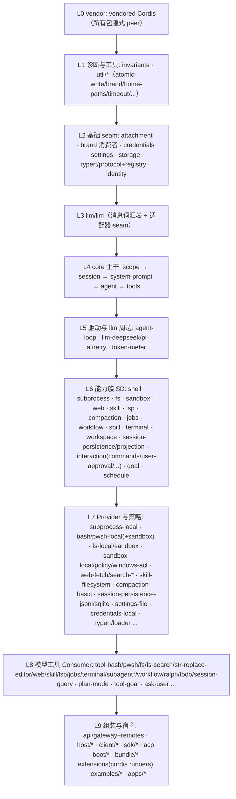

# 08 依赖关系

包间依赖以各包 `peerDependencies` 为权威信号（运行时依赖），由脚本生成并门禁保鲜：`docs/module-graph.md`（`pnpm run gen-module-graph` / `verify-module-graph`）。本章给出可读的分层归纳。

## 1. 依赖分层

从底到顶，包的依赖只能指向更低的层（同一能力族内的 SD→Provider→Consumer 除外）：



说明：上图是**概念分层**；个别包有意跨层（如 `compaction` SD 依赖 `commands`；`llm-retry` 依赖 `agent`；`tools` 依赖 `user-approval` 与 `code-runtime`）。精确边以 `docs/module-graph.md` 为准。

## 2. 共同根：invariants

`runtime-diagnostics/invariants` 被**几乎所有包 peer 依赖**（模块图中 60+ 条 `pkg_* --> pkg_invariants` 边）。它提供 `ctx.invariants` 注册表，让各包从 `./invariant` companion 安装运行时检查，普通入口不依赖诊断。同理 `util/brand`（`Branded<B>`）与 `util/home-paths` 是身份/路径类包的共同依赖。

## 3. 主干依赖链（自底向上）

```text
scope ─────────────────────────────┐
session ──> llm ──> attachment      │
    │           └──> brand, timeout │
    └──> scope, typert-protocol <───┘
system-prompt ──> llm, scope
agent ──> session, system-prompt, llm, scope, typert-protocol
tools ──> agent, session, system-prompt, llm, scope, code-runtime, user-approval
agent-loop ──> agent, tools, session, system-prompt, llm, scope,
               session-persistence, settings
```

要点：

- `core/session` 依赖 `llm/llm`（消息词汇表），但**不**依赖 agent-loop——日志先于驱动存在。
- `core/agent` 定义 `Agent` 接口与注册表；`agent-loop` 是**它的一个实现**（`implements AgentFactory`），可整体替换。
- `core/tools` 依赖 `interaction/user-approval`（工具升级审批）与 `code-runtime`（Code Mode 展示）——主干上少数横向依赖。

## 4. 能力族内部的三角色依赖形状

以 fs 族为例：

```text
fs (SD) ──> sandbox (SD), llm, brand
fs-local (Provider) ──> fs
fs-sandbox (Provider) ──> fs, fs-local, sandbox, sandbox-policy
tool-fs (Consumer) ──> fs, tools, system-prompt, session, sandbox-policy,
                       user-approval, attachment
tool-fs-search (Consumer) ──> tools, subprocess, spill, output-retention, timeout
```

通用规律：

1. **Provider 只依赖本族 SD（及它消费的其他 SD）**，绝不依赖 Consumer。
2. **Consumer 依赖本族 SD + core 主干（tools/system-prompt/session/llm）**，绝不依赖具体 Provider。
3. 组合 bundle（如 `agent-spine-demo`、`bundle/base`）是唯一允许同时引用多个具体 Provider 的层。

## 5. 关键横切依赖

| 依赖 | 消费方 | 原因 |
|---|---|---|
| `sandbox-policy` | tool-bash/pwsh、fs-sandbox、bash/pwsh-sandbox、terminal-bash、tool-fs、tool-str-replace-editor、permission-presets、subagent | 三大强制家族（fs/bash/terminal）读同一 `resolve({session})` 结果 |
| `session-persistence` | agent-loop、llm-retry、schedule、session-checkpoint-policy、session-query、subagent、hooks-*、tmux/shell-env、api-remotes、sdk | 驱动器与一切耐久功能需要 flush/读取日志 |
| `jobs` | tool-bash/pwsh（后台进程）、tool-terminal、tool-subagent、subagent SD | 后台工作统一走 job 注册表（job_output/job_list/job_kill） |
| `agent-presets` | subagent SD、api-remotes、host-apiproxy | 子代理 join 父 preset 组合；web 的 per-session 能力集 |
| `typert-protocol` / `typert-registry` | session、agent、goal、commands、message-feedback、cordis-host-runner、api-gateway、client-runtime、host-plugin-inventory | `@Remote`/`@RemoteScope` 与运行时反射 |
| `code-runtime` | core/tools | Code Mode 工具展示（RUN_CODE 保留传输） |

## 6. 组装层依赖快照

- `bundle/base` peer 几乎为零（它主要是 cordis.yml 补丁层），但 run 时组合了全部能力行（见其 `composition.md` 生成图）。
- `api-remotes` 是 Host 面依赖最宽的包（agent、agent-presets、api-gateway、commands、cordis-host-runner、credentials、goal、host-plugin-inventory、llm、message-feedback、session、session-persistence、settings、typert-registry）——它是 BFF，聚合所有 Remote 面。
- `client/ui-conversation` 是 Client 面依赖最宽的包（约 20 个依赖）——会话视图聚合所有特性插件的数据面。
- `client/*` 普遍依赖 `api-remotes + client-connection + client-runtime + client-ui-slots` 四件套（wire、连接、对象层、槽位）。

## 7. 依赖规则（摘自 `packages/README.md` 与根 AGENTS.md）

1. **扩展插件依赖 Service Definition，绝不依赖具体 Provider。**
2. `@deepseek-ai/cordis` 是所有 harness 包的 peerDependency（+ dev）。
3. 能力的三角色只在"独立演化"时拆包；否则可同包。
4. `peerDependencies` 是模块图判定的**唯一**运行时依赖信号；devDependencies 不计入。
5. Raw/Web `cordis.yml` bare 插件必须出现在其 resolver manifest 的 `dependencies`（`verify-cordis-config` 强制）。
6. `pnpm run constraints`（`scripts/check-workspace-constraints.ts`）遍历 Project Reference 图校验每个引用方的 compiler face（split 包必须引用匹配叶子而非 solution 根）。
